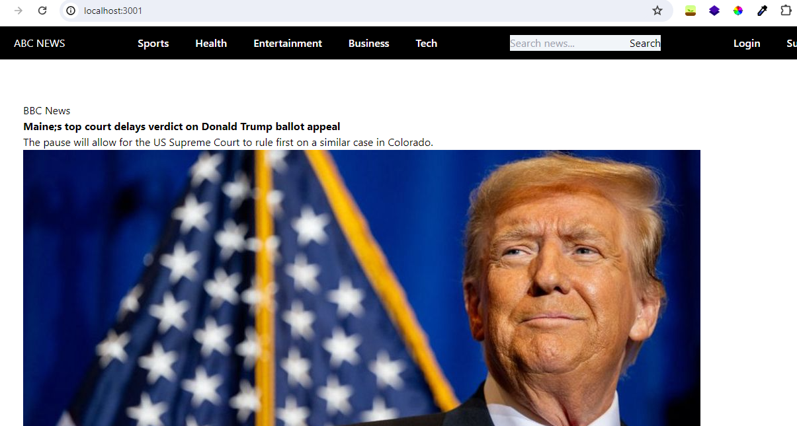
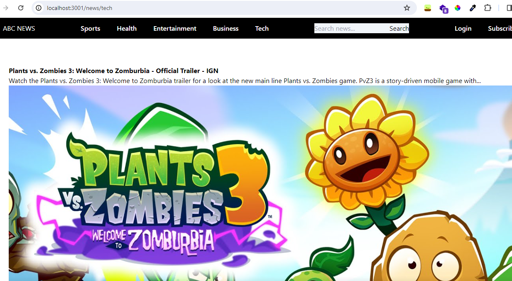
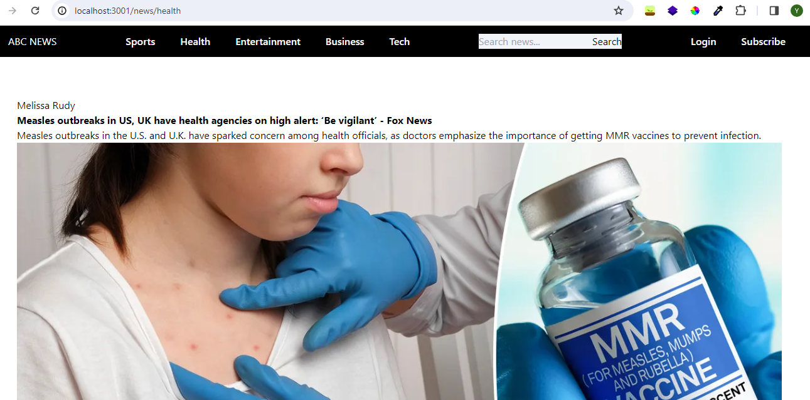
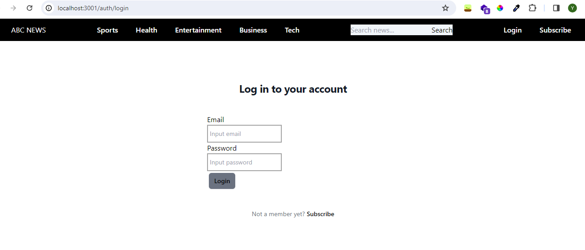

# NextJS News Web App with API from newsapi.org   
Updated version of React App [here](https://github.com/revou-fsse-3/milestone-2-smmuja)  

## Component  

- Public page  
Accessible by public, no authorization needed  
  - Home page  

    

  - Public news category  (Sports, Health, Entertainment)  
    
    

- Private page  
Authorization needed, users need to make subscription and login to gain access to contents     
  <!-- - Premium news category (Tech and Business)     -->
    

## Library and dependencies  

- [Next js](https://nextjs.org/)  
- Node js and NPM  
- Vite  
- Formik  
- Yup  
- Tailwind  
- Axios  

## API  
This web app is created with an API call from newsapi.org  
- API Documentation : https://newsapi.org/docs/  
- Plan : free plan/developer plan (https://newsapi.org/pricing)  

## Deployment  

This project cannot be deployed since free plan is only available for use on development (localhost) only  

But here's a video tour instead (to be updated):  
https://www.loom.com/share/e1261bcfa782476298288b440bd53abc  

Optionally, you can run on the development server:

```bash
npm run dev
# or
yarn dev
# or
pnpm dev
# or
bun dev
```

Open [http://localhost:3000](http://localhost:3000) with your browser to see the result.


Thanks for reading ~.^_^.~

